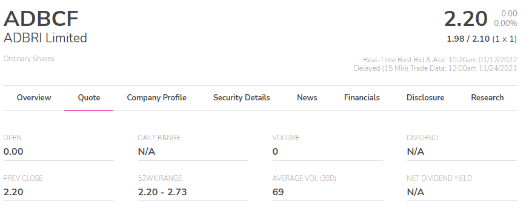
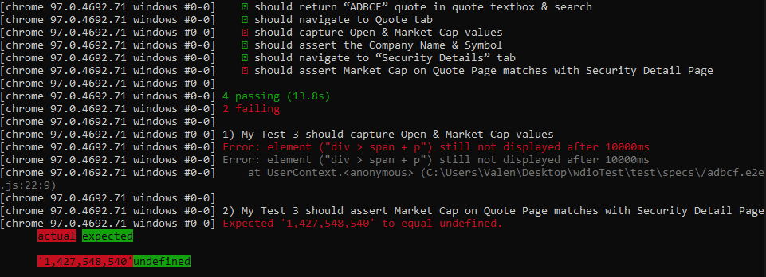

<h1 align="center">QA Automation Test</h1>

<p align="center">
  <a href="https://webdriver.io/">
      
  </a>
</p>

## About the Project

> QA Automation Test for OTC Markets.

 This program automatically searches for different companies, starting by entering each name in the page's search engine, and then looking for a series of requested data.
 - Website: http://www.otcmarkets.com

## System Requirements

You’ll need Node.js installed.

## Install

```sh
npm init wdio .
```

## Config

- Backend location: Local machine
- Framework: jasmine
- Compiler: Babel
- Reporter: Spec & Allure
- Tool: Chromedriver

## Run tests

```sh
npm run wdio
```

### About exclude test "ADBCF" in config

```sh
exclude: [
        './test/specs/adbcf.e2e.js'
    ],
```
It had to be exclude because it won't pass the test in points 3 & 4. The reason is that unlike the other two tests ("OTCM" & "RHHBY"), this one does not have a Market Cap.

> **Evidences:**



## Author ✨

:woman_technologist: Valentina Collareta
* GitHub: @ValentinaCollareta
* LinkedIn: @ValentinaCollareta